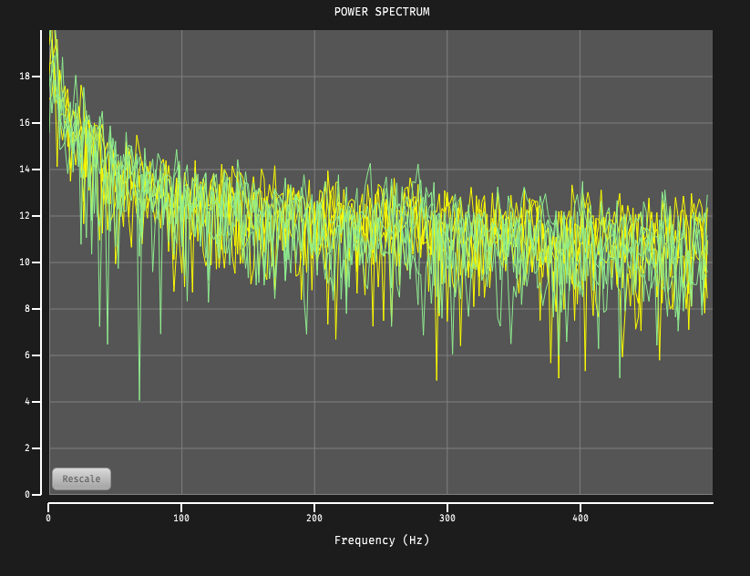

# Spectrum Viewer [](https://zenodo.org/badge/latestdoi/228703189)



Displays real-time power spectra for up to two channels within the Open Ephys GUI.


## Installation

(Coming soon)

## Usage

Recommended signal chain: File

## Building from source

First, follow the instructions on [this page](https://open-ephys.github.io/gui-docs/Developer-Guide/Compiling-the-GUI.html) to build the Open Ephys GUI.

**Important:** This plugin is intended for use with the pre-release core application, version 0.6.0. The GUI should be compiled from the [`development-juce6`](https://github.com/open-ephys/plugin-gui/tree/development-juce6) branch, rather than the `master` branch.

This plugin depends on the `main` branch of the [OpenEphysFFTW](https://github.com/open-ephys-plugins/OpenEphysFFTW/tree/main) library, which must be built and installed first.

Be sure to the `OpenEphysFFTW` and `spectrum-viewer` repositories into a directory at the same level as the `plugin-GUI`, e.g.:
 
```
Code
├── plugin-GUI
│   ├── Build
│   ├── Source
│   └── ...
├── OEPlugins
│   └── spectrum-viewer
│   │   ├── Build
│   │   ├── Source
│   │   └── ...
│   └── OpenEphysFFTW
│       ├── Build
│       ├── Source
│       └── ...
```

### Windows

**Requirements:** [Visual Studio](https://visualstudio.microsoft.com/) and [CMake](https://cmake.org/install/)

From the `Build` directory, enter:

```bash
cmake -G "Visual Studio 17 2022" -A x64 ..
```

Next, launch Visual Studio and open the `OE_PLUGIN_grid-viewer.sln` file that was just created. Select the appropriate configuration (Debug/Release) and build the solution.

Selecting the `INSTALL` project and manually building it will copy the `.dll` and any other required files into the GUI's `plugins` directory. The next time you launch the GUI from Visual Studio, the Grid Viewer plugin should be available.


### Linux

**Requirements:** [CMake](https://cmake.org/install/)

From the `Build` directory, enter:

```bash
cmake -G "Unix Makefiles" ..
cd Debug
make -j
make install
```

This will build the plugin and copy the `.so` file into the GUI's `plugins` directory. The next time you launch the GUI compiled version of the GUI, the Grid Viewer plugin should be available.


### macOS

**Requirements:** [Xcode](https://developer.apple.com/xcode/) and [CMake](https://cmake.org/install/)

From the `Build` directory, enter:

```bash
cmake -G "Xcode" ..
```

Next, launch Xcode and open the `grid-viewer.xcodeproj` file that now lives in the “Build” directory.

Running the `ALL_BUILD` scheme will compile the plugin; running the `INSTALL` scheme will install the `.bundle` file to `/Users/<username>/Library/Application Support/open-ephys/plugins-api`. The Grid Viewer plugin should be available the next time you launch the GUI from Xcode.


